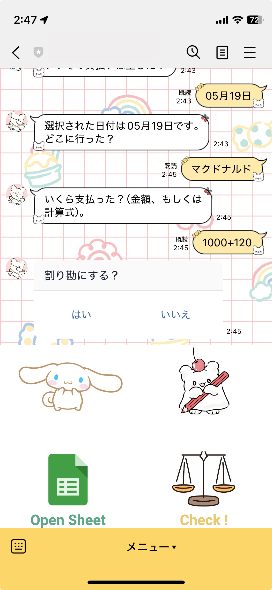
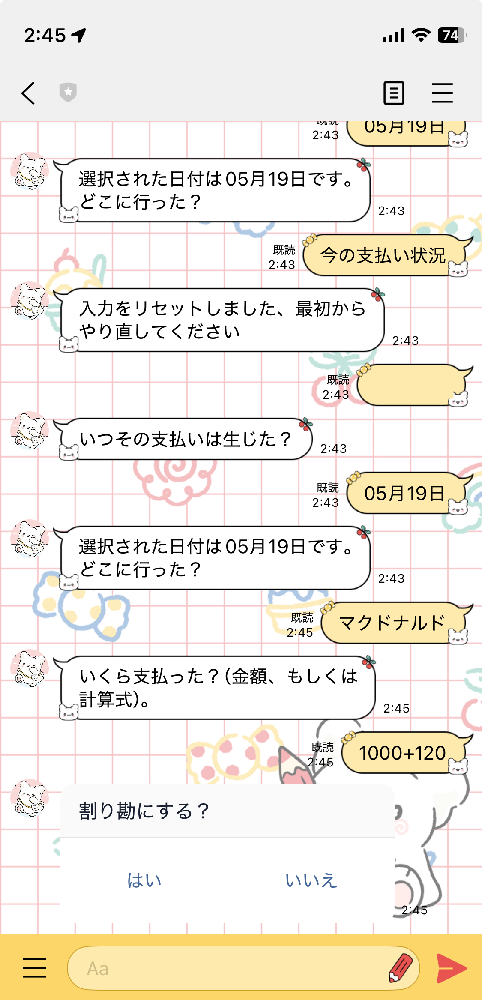

# LINE-bot
LINEで二人の間の貸し借りを管理するためのコードです。

夫婦間、カップル間、友人間といった、「いくら貸したっけ？」「いくら建て替えたっけ？」を管理します。
LINEで管理がしたかったことに加え、既存のアプリの機能が自分には多すぎたり少なかったので作りました。
【追記】
なんだかんだで時間がかかるのと、通販等等を管理できないのでLINEからGeminiでレシートや購入履歴を全部読み込んで自動で入力するアプリ開発に舵を切ったのでこのツールの更新予定はありません。




このリポジトリは、LINE Messaging API と Google Apps Script を使って2人のユーザーの支払い情報を入力・管理・通知する BOT です。  
メッセージの対話フロー（支払者選択 → 日付 → 場所 → 金額 → 割り勘・重複確認 → 保存 → 通知）を一連で自動化します。

---

## 🔖 目次

- [LINE-bot](#line-bot)
  - [🔖 目次](#-目次)
  - [🚀 機能](#-機能)
  - [⚙️ 前提条件](#️-前提条件)
  - [🔧 セットアップ](#-セットアップ)
  - [📡 デプロイと Webhook 設定](#-デプロイと-webhook-設定)
  - [📱 使い方](#-使い方)
  - [🗂 コード構成](#-コード構成)
  - [🔧 カスタマイズ](#-カスタマイズ)
  - [📄 ライセンス](#-ライセンス)
- [Write the README.md](#write-the-readmemd)

---

## 🚀 機能

- **支払者選択**：`User1` or `User2` で開始  
- **日付選択**：今日のクイックリプライ or カレンダーから選択  
- **場所入力**：自由入力  
- **金額入力**：数字 or 計算式 (`3000+2000` 等)  
- **割り勘確認**：はい/いいえ  
- **重複チェック**：既存レコードと重複時は保存前に確認  
- **保存**：Google スプレッドシートの「未精算」シートに記録  
- **ステータス確認**：`今の支払い状況` で合計・調整額を返答  
- **プッシュ通知**：入力完了後、相手ユーザーに通知

---

## ⚙️ 前提条件

- Google アカウント  
- LINE Developers で作成した Messaging API チャネル  
- Google Apps Script (GAS) プロジェクト  
- 対象の Google スプレッドシート  

---

## 🔧 セットアップ

1. リポジトリをクローン  
   ```bash
   git clone https://github.com/<あなたのユーザ名>/line-payment-bot.git
   cd line-payment-bot
   ```

2. `clasp` のインストール＆ログイン  
   ```bash
   npm install -g @google/clasp
   clasp login
   ```

3. GAS プロジェクトをローカルに Clone  
   - `clasp.json` の `scriptId` にご自身の GAS プロジェクト ID を設定  
   ```bash
   clasp clone
   ```

4. スクリプトプロパティに環境変数を設定  
   - GAS エディタ → 歯車アイコン → 「プロジェクトのプロパティ」 → スクリプトのプロパティ  
     - `ACCESS_TOKEN`：LINE チャネルアクセストークン  
     - `SPREADSHEET_ID`：対象スプレッドシート ID  
     - `SHEET_NAME_1`：未精算 用シート名  
     - `SHEET_NAME_2`：小計 用シート名  
     - `SHEET_NAME_3`：編集者一覧シート名  

5. `Code.gs` にプレースホルダを置き換え  
   ```javascript
   var ACCESS_TOKEN   = PropertiesService.getScriptProperties().getProperty('ACCESS_TOKEN');
   var SPREADSHEET_ID = PropertiesService.getScriptProperties().getProperty('SPREADSHEET_ID');
   // …他の SHEET_NAME も同様に取得
   ```

6. コードを GAS にプッシュ  
   ```bash
   clasp push
   ```

---

## 📡 デプロイと Webhook 設定

1. GAS → **公開** → **ウェブアプリケーションとして導入**  
   - **実行するユーザー**：自分  
   - **アプリケーションにアクセスできるユーザー**：自分のみ  

2. LINE Developers コンソールで **Webhook URL** を設定  
   ```
   https://script.google.com/macros/s/<GAS_SCRIPT_ID>/exec
   ```

3. **Webhook** を有効化  

---

## 📱 使い方

1. LINE で BOT に **友だち登録**  
2. トークで `User1` or `User2` と入力して開始  
3. ガイダンスに従って**日付・場所・金額**を入力  
4. 割り勘・重複チェックの**はい/いいえ**を選択  
5. 終了時にスプレッドシートに記録され、相手にプッシュ通知  

また、いつでも `今の支払い状況` と送信すると、現在の累計と調整額を確認できます。

---

## 🗂 コード構成

```
/
├── .clasp.json       # GAS クローン設定
├── appsscript.json   # GAS プロジェクト設定
├── Code.gs           # メインロジック
└── README.md         # 本ファイル
```

---

## 🔧 カスタマイズ

- `getExcludedUser()`：  
  - デフォルトではコード内の配列でユーザーを管理  
  - 必要に応じて `SHEET_NAME_3`（編集者一覧シート）から動的取得可能  
- シート列のレイアウトを変更する場合は、`saveData()` と `check_duplicate()` を要修正  
- 言語や応答文は `reply()` の引数を変更してください  

---

## 📄 ライセンス

MIT License。詳細は [LICENSE](./LICENSE) を参照。
"""

# Write the README.md
with open('/mnt/data/README.md', 'w') as f:
    f.write(readme)


